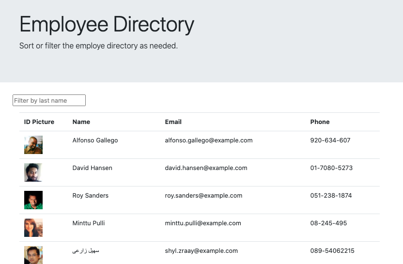
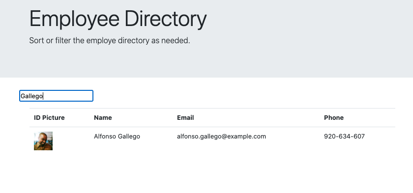

# React Homework: Employee Directory

### Overview
I created an employee directory with React. The application's UI is seperated into components, manages component state, and responds to user events.

# Project Links
[Link to GitHub Repo](https://github.com/jenniferdaeumler/gt-react-employee-directory)

[Link to GitHub Pages Deployed Site](https://jenniferdaeumler.github.io/gt-react-employee-directory/)

## User Story
As a user, I want to be able to view my entire employee directory at once so that I have quick access to their information.

## Business Context
An employee or manager would benefit greatly from being able to view non-sensitive data about other employees. It would be particularly helpful to be able to filter employees by name.

## Description
Given a table of random users, when the user loads the page, a table of employees renders. The user is be able to sort the table by last name and email.  The user can also filter by last name. 

## Table of Contents

1. [Installation](#installation)
2. [Usage](#usage)
3. [Credits](#credits)
4. [MIT License](#mit-license)
5. [Contributing](#contributing)

## Installation
Clone the repo, run in the browser.  

## Usage
The employees load on the page (100 random employees from the Random User API).  Click on the "Name" column header to sort by last name.  Type in a last name in the search form to filter employees. 

## Credits

Solo projected completed as homework for Georgia Tech Full-Stack Flex Program.
Trilogy Education provided assets.
[Random User API](https://randomuser.me/)

## MIT-License

Copyright (c) [2020][jennifer daeumler]

Permission is hereby granted, free of charge, to any person obtaining a copy
of this software and associated documentation files (the "Software"), to deal
in the Software without restriction, including without limitation the rights
to use, copy, modify, merge, publish, distribute, sublicense, and/or sell
copies of the Software, and to permit persons to whom the Software is
furnished to do so, subject to the following conditions:

The above copyright notice and this permission notice shall be included in all
copies or substantial portions of the Software.

THE SOFTWARE IS PROVIDED "AS IS", WITHOUT WARRANTY OF ANY KIND, EXPRESS OR
IMPLIED, INCLUDING BUT NOT LIMITED TO THE WARRANTIES OF MERCHANTABILITY,
FITNESS FOR A PARTICULAR PURPOSE AND NONINFRINGEMENT. IN NO EVENT SHALL THE
AUTHORS OR COPYRIGHT HOLDERS BE LIABLE FOR ANY CLAIM, DAMAGES OR OTHER
LIABILITY, WHETHER IN AN ACTION OF CONTRACT, TORT OR OTHERWISE, ARISING FROM,
OUT OF OR IN CONNECTION WITH THE SOFTWARE OR THE USE OR OTHER DEALINGS IN THE
SOFTWARE.

## Contributing

If you created an application or package and would like other developers to contribute it, you will want to add guidelines for how to do so. The [Contributor Covenant](https://www.contributor-covenant.org/) is an industry standard, but you can always write your own.